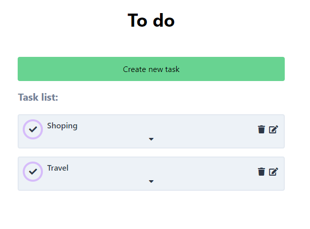

# Todo list

> This is my todo list create in React. In this application you can add a task, edit or remove it.

## General info

In this application I was practis how to build React component, send a request to add, remove or modify element of my list. I also used React Router to change the page to create or edit task.

## Screenshots

> Create task form:
> 
> Task list
> 
> Edit task
> 

## Technologies

- React
- HTML5
- Tailwind CSS

## Setup

To run this repository:

- Clone or download the repo
- _yarn_ to install dependencies
- _yarn start_

## Features

- Add task
- Edit task
- Remove task
- check task

In the fauter I want to add user login and authentication.

## Status

Project is: _in progress_

## Inspiration

This project was created during my frontend bootcamp.
